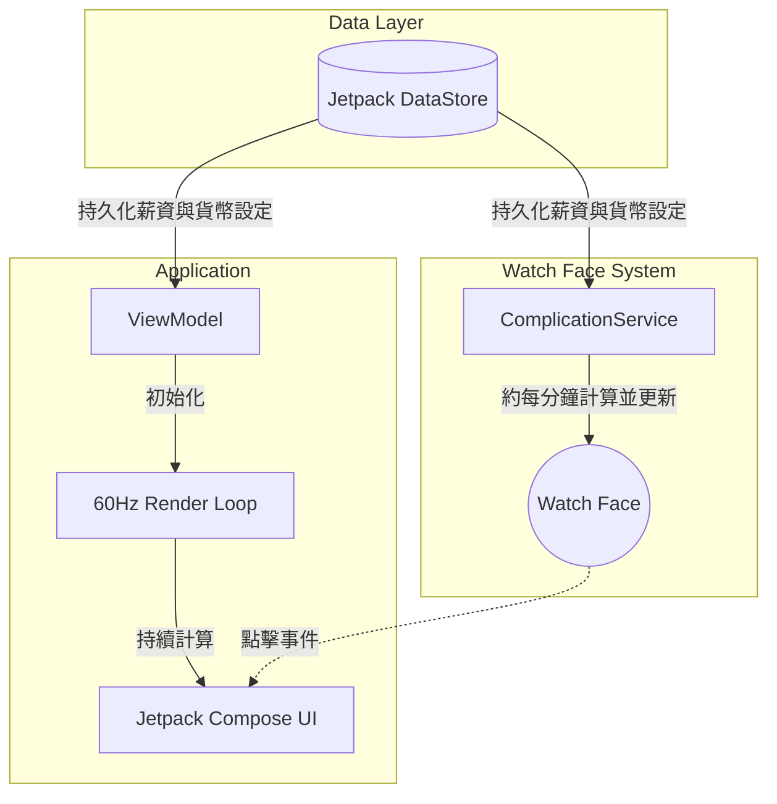

<div align="center">

[Read in English](README.md) | [閱讀繁體中文版](README_zh.md)


# WatchMyMoney

**在 Wear OS 上即時視覺化您的收入。**

[](#)
[](#)
[](LICENSE)
[](#)
[](#)

</div>

---

## 專案概述

**WatchMyMoney** 是一款專為 Wear OS 4/5 打造的雙元件應用程式。本專案在設計上兼顧了高效能與省電特性，讓使用者能夠即時掌握自己的每日收入。

系統主要由兩種核心體驗構成：
1. **錶面小工具 (Complication)**：針對電池續航力進行最佳化的被動式追蹤器，可無縫整合至您的錶面。它大約每分鐘更新一次，在減少系統喚醒次數的同時，讓您的收入狀況一目了然。
2. **獨立應用程式 (Standalone App)**：提供 60fps 高精準度計算的沉浸式體驗。只需輕觸錶面小工具，應用程式便會啟動，即時且精確到小數點後多位地呈現您的財富增長，帶來立即的視覺滿足感。

---

## 核心功能

### ⌚ 智慧型錶面小工具
- **省電設計**：採用低頻率被動更新（約每分鐘一次），大幅延長手錶電池壽命。
- **高相容性排版**：完美適配各種錶面資訊槽，支援 `SHORT_TEXT`（圓形圖示）、`LONG_TEXT`（寬型文字）以及 `RANGED_VALUE`（進度條）等格式。
- **快速存取**：直接點擊錶面小工具，即可啟動完整的即時追蹤應用程式。

### 🚀 高效能視覺體驗
- **60Hz 即時渲染**：提供流暢、高精確度的動畫效果。
- **微毫級精準度**：以極小的小數點單位持續追蹤收入累積（例如：`$120.5439`）。
- **智慧型生命週期管理**：當使用者放下手腕或螢幕關閉時，系統會立即停止渲染與計算，最大化節省電量。

### ⚙️ 使用者友善設計
- **無縫上手體驗**：內建針對手錶螢幕最佳化的數字鍵盤，無須依賴手機端應用程式，即可輕鬆輸入薪資。
- **高度客製化**：使用者可自行設定年薪、本地貨幣符號以及每日重置的時間點。

---

## 系統架構

本專案嚴格遵循 Wear OS 的現代 Android 開發標準。

### 技術堆疊

| 元件 | 技術 |
| :--- | :--- |
| **程式語言** | 100% Kotlin |
| **UI 框架** | Jetpack Compose for Wear OS |
| **Complication API** | `androidx.wear.watchface:watchface-complications-data-source-ktx` |
| **資料儲存** | Jetpack DataStore (Preferences) |
| **架構模式** | MVVM (Model-View-ViewModel) |

### 系統設計與資料流



### 核心邏輯實作

計算引擎完全在本地端執行，確保隱私與離線可用性。收入累積純粹基於時間差進行計算：

```kotlin
// 每日薪資 = 年薪 / 365.25
// 每毫秒薪資率 = 每日薪資 / 86,400,000
val msPassedToday = System.currentTimeMillis() - midnightTimestamp
val earned = msPassedToday * ratePerMillisecond
```

---

## 快速入門

### 系統需求

- **開發環境**：Android Studio Koala（或更新版本）
- **SDK**：Android SDK API 33+ (Wear OS 4)
- **硬體/模擬器**：實體 Wear OS 裝置或 API 33+ 的 Wear OS 模擬器。

### 安裝步驟

1. **複製原始碼儲存庫：**
   ```bash
   git clone https://github.com/your-org/WatchMyMoney.git
   cd WatchMyMoney
   ```
2. **在 Android Studio 中開啟：** 開啟專案資料夾，Gradle 將會自動開始同步。
3. **設定執行目標：** 從下拉式選單中選擇 `wear` 執行設定。
4. **部署與測試：** 點擊執行 (Shift+F10) 將應用程式部署至已連接的手錶或模擬器。

---

## 使用指南

1. **初始設定：** 從應用程式啟動器開啟 App，或將小工具新增至您的錶面。
2. **參數配置：** 若系統偵測不到薪資資料，設定畫面將自動彈出。請使用畫面上的數字鍵盤輸入您的**年薪**。
3. **開始追蹤：** 錶面小工具會立即開始追蹤您的每日收入。隨時點擊它，享受財富即時增長的樂趣。

---

## 參與貢獻

我們非常歡迎開源社群的貢獻！無論是修復 Bug、完善文件，或是提出新功能，您的協助對我們來說都彌足珍貴。

請參閱 [CONTRIBUTING.md](CONTRIBUTING.md) 以獲取有關如何提交 Pull Request、程式碼規範與行為準則的詳細說明。

---

## 授權條款

本專案採用 MIT 授權條款 - 詳情請參閱 [LICENSE](LICENSE) 檔案。
