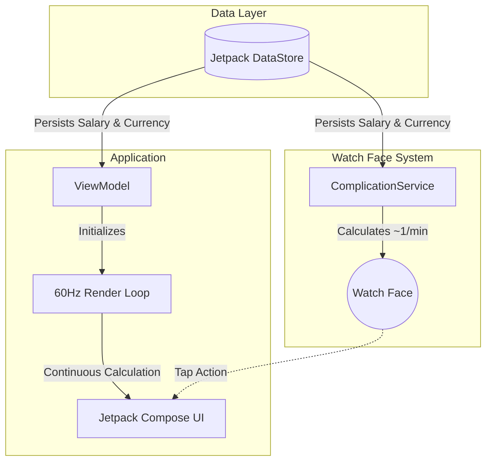

<div align="center">

[Read in English](README.md) | [閱讀繁體中文版](README_zh.md)


# WatchMyMoney

**Visualize your income in real-time on Wear OS.**

[](#)
[](#)
[](LICENSE)
[](#)
[](#)

</div>

---

## Overview

**WatchMyMoney** is a dual-component application engineered for Wear OS 4/5. Designed with both performance and power efficiency in mind, it provides users with real-time visibility into their daily earnings.

The system is composed of two primary experiences:
1. **The Complication**: A battery-optimized, passive tracker that integrates seamlessly into your watch face. It updates approximately once per minute, minimizing system wakeups while keeping your earnings in sight.
2. **The App**: An immersive, 60fps high-precision counter. Upon tapping the complication, the app renders your growing income down to the decimal point in real-time, delivering immediate visual gratification.

---

## Key Features

### ⌚ Smart Complication
- **Battery-Conscious Updates**: Operates passively with low-frequency updates (~1/min) to preserve battery life.
- **Flexible Data Sources**: Seamlessly adapts to various watch face slots, supporting `SHORT_TEXT` (Circular), `LONG_TEXT` (Wide), and `RANGED_VALUE` (Progress Bars).
- **Deep Integration**: Tap the complication directly from the watch face to launch the full real-time tracker.

### 🚀 High-Performance App
- **60Hz Real-Time Rendering**: Delivers fluid, high-precision animation.
- **Micro-transaction Precision**: Tracks earnings continuously down to fractions of a cent (e.g., `$120.5439`).
- **Context-Aware Lifecycle**: Intelligently halts rendering and calculations the moment the wrist is lowered or the screen turns off, maximizing power efficiency.

### ⚙️ User-Centric Design
- **Frictionless Onboarding**: Features an optimized on-watch number pad for effortless salary input—no companion app required.
- **Customizable Metrics**: Allows users to input their annual salary, set localized currency symbols, and customize daily reset intervals.

---

## Architecture

This project strictly adheres to modern Android development standards for Wear OS.

### Tech Stack

| Component | Technology |
| :--- | :--- |
| **Language** | 100% Kotlin |
| **UI Framework** | Jetpack Compose for Wear OS |
| **Complication API** | `androidx.wear.watchface:watchface-complications-data-source-ktx` |
| **Data Persistence** | Jetpack DataStore (Preferences) |
| **Architecture Pattern** | MVVM (Model-View-ViewModel) |

### System Design & Data Flow



### Core Logic Implementation

The calculation engine is entirely local, ensuring privacy and offline functionality. Earnings are derived continuously based on elapsed time:

```kotlin
// Daily Salary = Annual Salary / 365.25
// Rate Per Millisecond = Daily Salary / 86,400,000
val msPassedToday = System.currentTimeMillis() - midnightTimestamp
val earned = msPassedToday * ratePerMillisecond
```

---

## Getting Started

### Prerequisites

- **IDE**: Android Studio Koala (or newer)
- **SDK**: Android SDK API 33+ (Wear OS 4)
- **Hardware/Emulator**: A physical Wear OS device or an API 33+ Wear OS emulator.

### Installation

1. **Clone the repository:**
   ```bash
   git clone https://github.com/your-org/WatchMyMoney.git
   cd WatchMyMoney
   ```
2. **Open in Android Studio:** Open the project folder. Gradle sync should start automatically.
3. **Build Target:** Select the `wear` run configuration from the dropdown.
4. **Deploy:** Click Run (Shift+F10) to deploy to your connected watch or emulator.

---

## Usage

1. **Initial Setup:** Launch the app from the launcher or add the complication to your watch face.
2. **Configuration:** If no salary data is detected, the setup screen will automatically appear. Enter your **Annual Salary** using the on-screen keypad.
3. **Tracking:** Your complication will instantly begin tracking your daily earnings. Tap it anytime to watch your money grow in real-time.

---

## Contributing

We welcome contributions! Whether you're fixing a bug, improving the documentation, or proposing new features, your help is appreciated.

Please see our [CONTRIBUTING.md](CONTRIBUTING.md) file for detailed instructions on how to submit pull requests, our coding standards, and our code of conduct.

---

## License

This project is licensed under the MIT License - see the [LICENSE](LICENSE) file for details.
